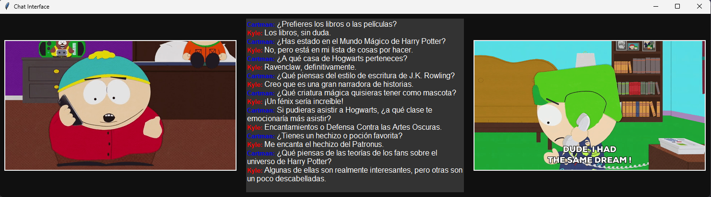
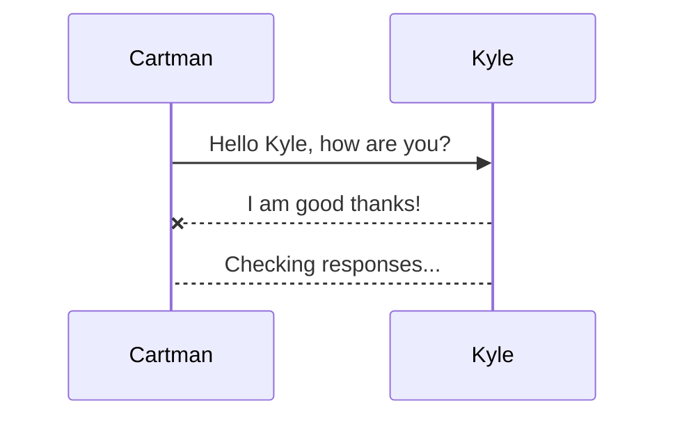
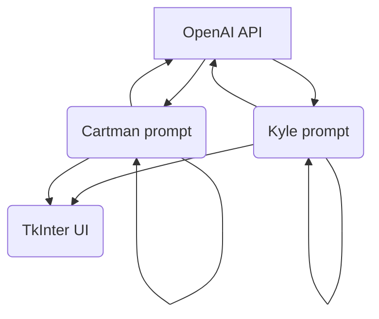

# DialogGPT: ChatGPT AI Dialogues

  

This Python program uses the tkinter library to create a chat interface between two people. The program loads a pre-written conversation between two characters and displays it in a GUI. Additionally, it utilizes text-to-speech technology to speak the messages out loud as they are displayed.

The GUI includes a text box where users can type their responses, and a button to submit the response to the conversation. The program then generates a response based on the user's input using the OpenAI API, and adds it to the conversation.

The conversation between the two characters is pre-written in a separate file, and the program loads it when it is run. The user can continue the conversation as long as they like, with the program generating new responses based on the conversation history.

Overall, this program provides an interactive and engaging chat experience using Python and the OpenAI API.

## Requirements

-   Python 3.x
-   tkinter
-   PIL
-   pyttsx3
-   dotenv

## Usage

1.  Clone the repository to your local machine.
2.  Create a new virtual environment for the project and activate it.
3.  Install the dependencies using `pip install -r requirements.txt`.
4. Create an `.env` from the `.env.example` provided.
5.  Add your OpenAI API key to a `.env` file in the root directory.
6.  Run the program using `python chat_interface.py`.

## Description of files

-   `launch.py`: The main file that implements the chat interface.
-   `data/*`: Contains test dialogues and prompts for the program to use.
-   `openai_api.py`: Defines the function that calls the OpenAI API to get conversation data.

## Description of code

-   The `ImageLabel` class is a custom tkinter label that can display animated gifs.
-   The `ChatInterface` class handles the GUI and the conversation.
-   The `send_dialogue` method sends the conversation messages and displays them on the GUI.
-   The `print_message` method displays the messages in the text box.
-   The `speak_message` method uses text-to-speech to speak the messages out loud.
-   The `main` method loads the test dialogues or gets the dialogues from the OpenAI API and creates the main window and chat interface.

- `openai_request(language)` that takes a language parameter and returns a dictionary with two lists: the sender's and receiver's response lists, which are generated by having a conversation between two fictional characters, Cartman and Kyle, about the Harry Potter universe. The conversation is carried out by using a prompt-based approach where the initial prompts are defined in the `init_prompts.py` file. The function uses the `delete_line_break()` function to remove line breaks from the response lists and the `openai_connection()` function to make requests to the OpenAI API with retries. The `openai_request()` function generates the responses from Cartman and Kyle iteratively by concatenating their prompts with each other's responses until a specified number of iterations is reached.

## How it works
We have an initial prompt for both characters, which will have a brief description providing context for their personality and situation. As the conversation progresses, the prompt accumulates context from the responses and is sent in its entirety with each iteration.

And this will produce a flow chart:

## Credits

This chatbot was created by Fernando Gonzalez (nandodev) as a little experiment with the OpenAI API. Feel free to Fork or Clone the repository.